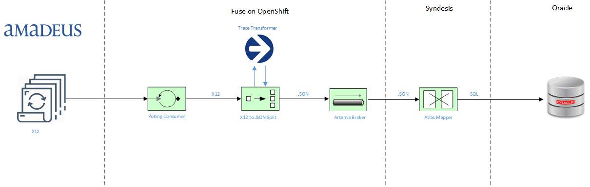
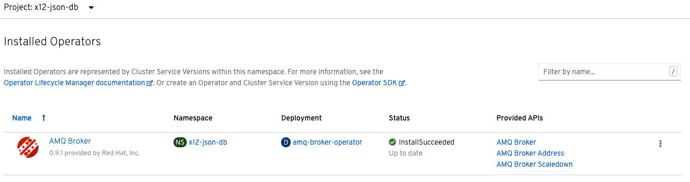
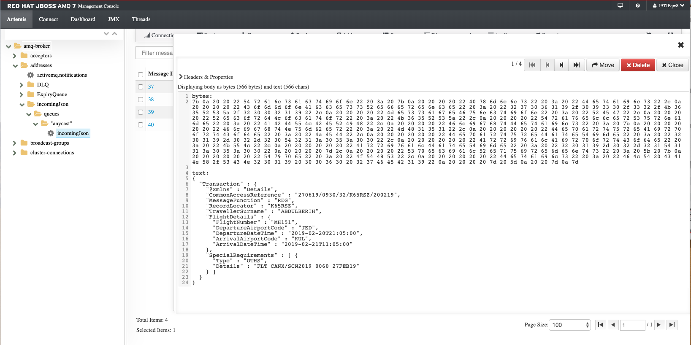
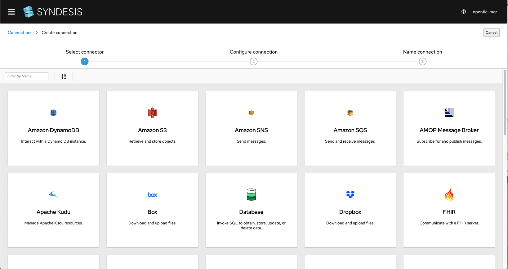
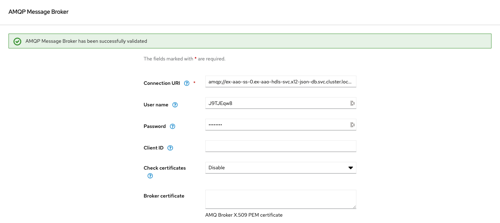
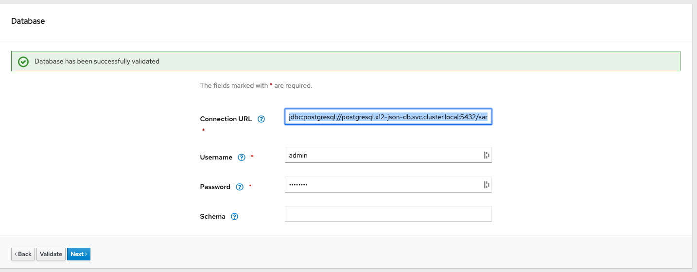
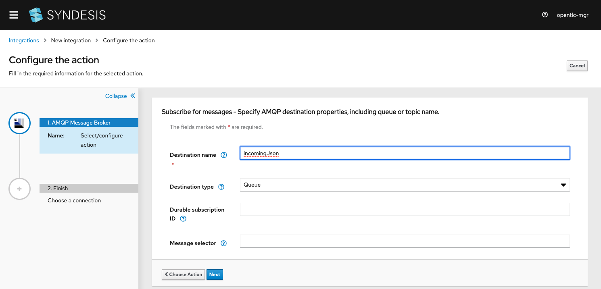
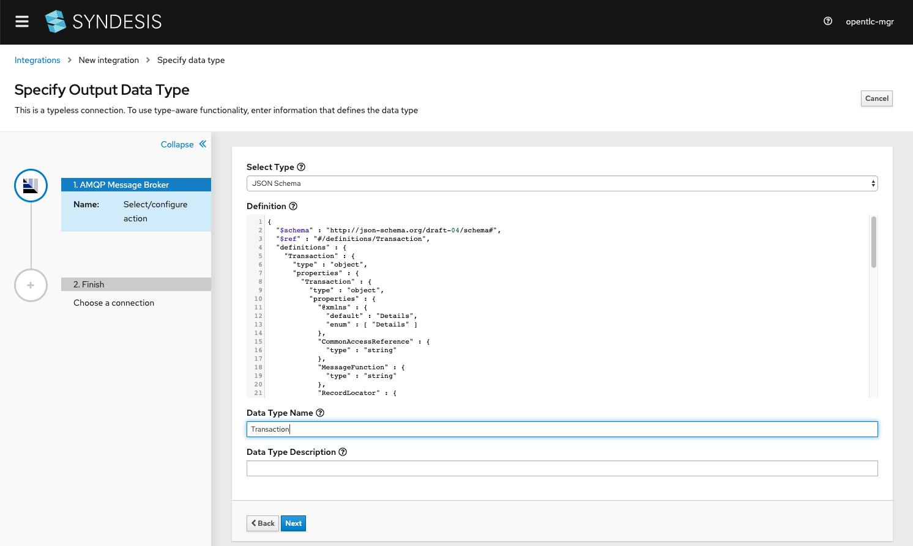
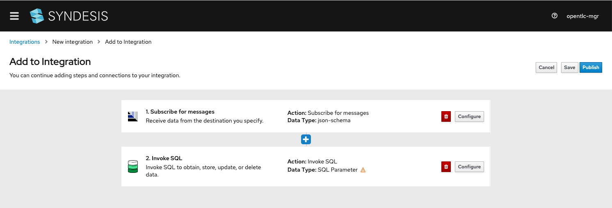
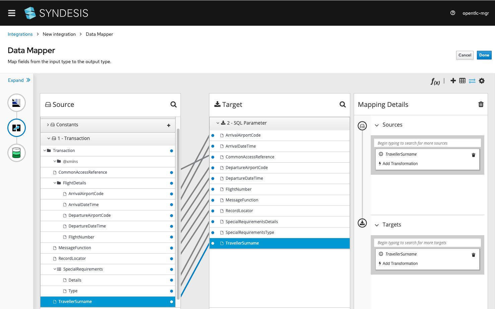

X12 to JSON to DB Processor<br />using Trace Transformer, Fuse & Syndesis
====================================

This project demonstrates consuming a large X12 batch file and splitting it into multiple JSON transaction messages.  From there, we consume the multiple JSON messages of a queue and insert them as records into a database.



## Prerequisites

- VSCode 1.4+
- OpenShift 4.2+
- Trace Transformer 3.7.4
- Fuse 7.5 Image Streams (template found [here](https://raw.githubusercontent.com/jboss-fuse/application-templates/master/fis-image-streams.json))

Firstly, start by downloading the registy key from [here](https://access.redhat.com/terms-based-registry/).  You will need a redhat.com login for this.  Create a new Registry Service Account for your OpenShift environment and import it using the following command:

```
oc project openshift
oc create -f blah-secret.yaml
oc secrets link default <pull_secret_name> --for=pull
oc secrets link builder <pull_secret_name>
```

Secondly, we need to update the Fuse image streams to Fuse 7.5:

```
export BASEURL=https://raw.githubusercontent.com/jboss-fuse/application-templates/master/fis-image-streams.json
oc apply -n openshift -f ${BASEURL}
```

Lastly, request an evaluation license from [Trace Financial](https://www.tracefinancial.com/contact-us).  For the purpose of this example, Transformer version 3.7.4 is assumed.  Once the Transformer tooling has been downloaded, please execute the following steps to copy the required files to your local Maven repository:

1. Copy <transformer-install-dir>\runtime\3.7.4\maven\transformer-runtime-skinny-3.7.4.jar to a temp directory

2. Copy <transformer-install-dir>\runtime\3.7.4\maven\transformer-runtime-skinny-3.7.4.pom to a temp directory

3. Copy <transformer-install-dir>\runtime\3.7.4\currency-lib to a temp directory

4. Generate a Trace runtime license JAR file and copy to a temp directory

5. Execute the following commands via the CLI to install the prerequisite JAR files in your local Maven repostiory:

```
mvn install:install-file -DgroupId=com.tracegroup.transformer -DartifactId=transformer-runtime-skinny -Dversion=3.7.4 -Dpackaging=pom -Dfile=transformer-runtime-skinny-3.7.4.pom.xml

mvn install:install-file -DgroupId=com.tracegroup.transformer -DartifactId=currencylib -Dversion=1.0.12 -Dfile=currencylib-1.0.12.jar -Dpackaging=jar

mvn install:install-file -DgroupId=com.tracegroup.transformer -DartifactId=RedHat.06032020.1.lic -Dversion=1.0.0 -Dfile=RedHat.06032020.1.lic.jar -Dpackaging=jar
```

5. Install the Trace Transformer sample project to your local Maven repository by executing the following command:

```
mvn install:install-file -DgroupId=com.tracefinancial.amadeus -DartifactId=amadeus -Dversion=1.0.0 -Dfile=amadeus-1.0.0.jar -Dpackaging=jar
```

## Deployment

This project can be deployed using the following method:

* On an Openshift 4.2+ environment using Fuse 7.5.

## Openshift Deployment

First, create a new OpenShift project called *x12-json-db*

```
oc new-project x12-json-db --description="Fuse X12 to JSON to DB" --display-name="X12-JSON-DB"
```

Secondly, create a test database for us to insert records:

```
oc new-app --template postgresql-ephemeral -p POSTGRESQL_USER=admin -p POSTGRESQL_PASSWORD=password -p POSTGRESQL_DATABASE=sampledb
```

Next, create an Artemis broker for us to send the JSON transactions to.  This can be done via OperatorHub UI, by selecting and installing the *AMQ Broker* Operator:



Be sure to create an *AMQ Broker Address* using the custom resource defined in `configuration/incomingJsonAddress.cr`.
Also, create an *AMQ Broker* using the following custom resource: `configuration/artemisBroker.cr`.

Once the Broker is deployed, copy/paste the `AMQ_USER` and `AMQ_PASSWORD` from the `ex-aao-credentials-secret` secret, and update the `src/main/resources/application.yml` file with those credentials under the *amqp* entry.

Lastly, execute the following command which will execute the *openshift* profile that executes the `clean fabric8:deploy` maven goal:

```
mvn -Popenshift
```

The fabric8 maven plugin will perform the following actions:

* Compiles and packages the Java artifact
* Creates the OpenShift API objects
* Starts a Source to Image (S2I) binary build using the previously packaged artifact
* Deploys the application using binary streams

## Command Line Testing

Using a command line, execute the following to query the definition service

```
oc get pods |grep fuse-springboot2 [to retrieve the fuse-springboot-x12-json* pod name]
oc rsync src/data fuse-springboot2-x12-json-<insert unique pod ID>:/deployments/src
```

You can check the JSON messages via the AMQ Management console [here](http://ex-aao-wconsj-0-svc-rte-x12-json-db.apps.cluster-mas-54fa.mas-54fa.example.opentlc.com/).  Use the credentials from your application.yml to login.  Navigate to the *incomingJson* queue and select *Browse*.  You should be able to see 4 JSON messages here:




## Install Syndesis

Follow this procedure to install the correct version of Syndesis (version 1.9.1-20200220):

1. Download this version of the Syndesis Operator for your OS [here](https://github.com/syndesisio/syndesis/releases/tag/2.0.1-20200220).  Be sure to download both *Syndesis-Operator* and *Syndesis-CLI*.  Unzip both files to a temporary directory.

2. Execute the following commands:

```
oc new-project syndesis
./syndesis-operator install
```

3. Open the secrets.yml file that was created during the *Prerequisites* section above in a text editor, and copy/paste the contents to Secrets / Create Secret via the OCP UI.  Change the name of the secret to `syndesis-pull-secret`.

4. Execute the following commands:

```
oc project syndesis
oc secrets link syndesis-operator syndesis-pull-secret --for=pull
```

5. Install Syndesis using the following command:

```
./syndesis install --setup
./syndesis install
```

6. Wait for Syndesis to install. Once all the pods are running, navigate [here](https://syndesis-syndesis.apps.cluster-mas-54fa.mas-54fa.example.opentlc.com/) and login.

## Create Sydnesis integration flow

Once you have Syndesis installed and you're able to login, create the following:

1. Navigate to Connections and click on *AMQP Message Broker*.



2. Enter the *AMQP* credentials taken from your `src/main/resources/application.yml` file.  Be sure to select *Check certificates: Disable*.  Click *Next* and save using the default name / description.



3.  Repeat step #2 exception select *Database*.  Enter `jdbc:postgresql://postgresql.x12-json-db.svc.cluster.local:5432/sampledb` as the Connection URL, and `admin` / `password` for the Username / Password.  Click Validate then Next.  Save as *Transaction Database*.



4. Click *Integrations* then *New Integration*.  Select *AMQP Message Broker* as the start.  Enter `incomingJson` as the queue name and click *Next*.



5.  For the AMQP datatype, select *JSON Schema*.  Copy/paste the contents of `configuration/Details.json` into the Definition window.  Give it the `Data Type Name` of *Transaction*.  Click Next.



6. For the *Finish Integration*, select *Transaction Database*. Select *Invoke SQL* then copy the following SQL into the *SQL statement* field:

```
INSERT INTO transaction_details (CommonAccessReference,MessageFunction,RecordLocator,TravellerSurname,FlightNumber,DepartureAirportCode,DepartureDateTime,ArrivalAirportCode,ArrivalDateTime,SpecialRequirementsType,SpecialRequirementsDetails) VALUES (:#CommonAccessReference,:#MessageFunction,:#RecordLocator,:#TravellerSurname,:#FlightNumber,:#DepartureAirportCode,:#DepartureDateTime,:#ArrivalAirportCode,:#ArrivalDateTime,:#SpecialRequirementsType,:#SpecialRequirementsDetails)
```

7.  If you have completed the preceding steps correctly, you should see the below screen.  Now that we have setup the source and destination points, we need to map the content from JSON to SQL.



8. Click the **+** symbol between the source / destination.  Select *Data Mapper* as the action, then drag-and-drop the fields to match source and target.  Click *Done* then *Publish*.  Give it the name `JSONToSQL` and click *Save and publish*.



9. Once the integration starts, you should notice that under *Metrics* 4 messages have been processed. You'll also notice under Activity that some messages have been consumed. If you'd like to verify the database, navigate back to the OpenShift console to the `x12-json-db` project and select the *postsql* pod.  Click on terminal and type the following:

```
psql
\c sampledb
select * from transaction_details;
```

If the integration has completed successfully, you should see the following SQL output:

```
sampledb=# select * from transaction_details;
    commonaccessreference     | messagefunction | recordlocator | travellersurname | flightnumber | departureairportcode |  departuredatetime  | arrivalairportcode |   arrivaldatetime   | specialrequirementstype |              specialrequirementsdetails              
 
------------------------------+-----------------+---------------+------------------+--------------+----------------------+---------------------+--------------------+---------------------+-------------------------+------------------------------------------------------
-
 270619/0930/32/K65RSZ/200219 | REG             | K65RSZ        | ABDULBERIH       | MH151        | JED                  | 2019-02-20T21:05:00 | KUL                | 2019-02-21T11:05:00 | OTHS                    | FLT CANX/SCN2019 0060 27FEB19
 270619/0930/10/K65USH/250619 | REG             | K65USH        | MARRYULUNG       |              |                      |                     |                    |                     | OTHS                    | MH SEGMENT CANCEL DUE TO TIME LIMIT EXPIRY
 270619/0930/22/K65YG2/250619 | REG             | K65YG2        | CHANG            | MH759        | SGN                  | 2019-06-28T16:40:00 | KUL                | 2019-06-28T19:40:00 | CTCM                    | 60196668567
 270619/0930/32/K669GY/200619 | REG             | K669GY        | HUQ              | MH103        | DAC                  | 2019-06-25T12:15:00 | KUL                | 2019-06-25T18:10:00 | DOCS                    | P/BGD/OC2208543/BGD/01JAN72/F/28JAN22/DEY/ALAKA PRAVA
(4 rows)
```